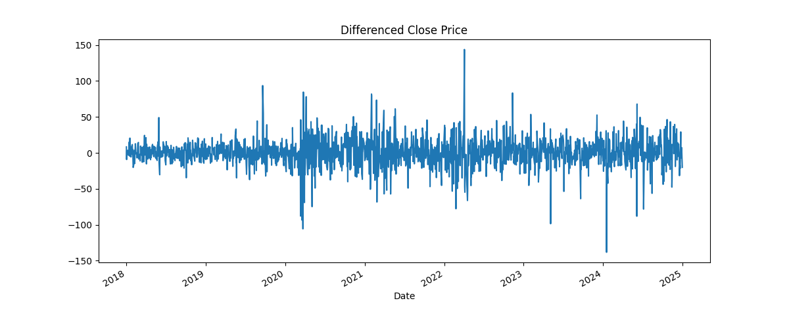

# Stock Price Prediction – HDFCBANK.NS (NSE)

#### This project focuses on analyzing and predicting the stock prices of HDFC Bank Ltd. (HDFCBANK.NS) listed on the National Stock Exchange (NSE) of India. Using historical market data collected via the yfinance Python library, this project applies time series forecasting techniques to understand stock trends and make future price predictions.
## Tech

 **Language**                `Python`

 **Financial Service**                    `yfinance `

 **Data Handling**            `numpy`

 **Data Visualization**      `matplotlib`

 **Machine Learning**        `adfuller`, `SARIMAX`, `ARIMA`

 **Jupyter Environment**     `Jupyter Notebook` or `Google Colab`

 **code editors/IDEs**       `Pycham` or `VS Code (Visual Studio Code)`

 **Version Control**         `git`, `GitHub`
 
 **Environment Management**  `venv`

## Environment Variables

1. What environment variables are needed

2. Why they’re used

### Prerequisites

Make sure you have the following installed:

1. Python 3.7 or higher

2. pip (Python package manager)

3. Git (for cloning the repository)


### Step 1: Clone the Repository

#### Open your terminal or command prompt and run:

git clone https://github.com/yyugesh/stock_price_prediction-HDFCBANK.NS-_-NSE-.git

### Step 2: Set Up a Virtual Environment

#### Windows
python -m venv venv
venv\Scripts\activate

#### macOS/Linux
python3 -m venv venv
source venv/bin/activate


## Installation & Running the Project

Follow these steps to install and run the Penguin Species Prediction using Machine Learning project on your machine.

### Step 1: Install Required Libraries
    
Run the following commands to install the necessary dependencies:

1. Install **pandas**

    ```
    pip install pandas
    ```

2. Install **numpy**

    ```
    pip install numpy
    ```

3. Install **matplotlib**

    ```
    pip install matplotlib
    ```

4. Install **seaborn**

    ```
    pip install seaborn
    ```

5. Install **scikit-learn**

    ```
    pip install scikit-learn
    ```

Or if you have a requirements.txt file:

    ```
    pip install -r requirements.txt
    ```

### Step 2: Run the project 

Jupyter Notebook, VS Code, or PyCharm, among others are the popular code editors/IDEs.

## Features

- **yfinance HDFCBANK.NS (NSE)**: The dataset for HDFCBANK.NS stock price analysis is retrieved from Yahoo Finance using the yfinance library. The dataset contains the following key features:

- **Data Preprocessing**: Handles missing values, encodes numerical features, or data.

- **Exploratory Data Analysis (EDA)**: Visualizes relationships using pair plots, box plots, and heatmaps.

- **Machine Learning Models**:
  - ARIMA
  - SARIMAX

- **Model Evaluation**: Assesses performance using metrics like R², MAE, MSE and RMSE Report.

- **Train-Test Split**: Ensures unbiased model evaluation.
## Screenshots

### 1. Pre-processing Data Analysis


### 2. Model Prediction Output





### 3. Model Evaluation Comparison Output


## Demo

Check out the demo of the Penguin Species Prediction app:

[Click here to try the app](https://github.com/yyugesh/stock_price_prediction-HDFCBANK.NS-_-NSE-/blob/f0813f77830d7d9d39e7403108d9ec013d224548/Stock%20Price%20Prediction.gif)  
## About the Dataset

- Data Source:
    Stock price data is fetched using the yfinance Python library, which connects to Yahoo Finance.

- Ticker used: HDFCBANK.NS (HDFC Bank Limited - NSE).

- Time Frame:
    The time series data can be pulled for any range using the start and end parameters. Common ranges include 1 year, 5 years, or max available.

- Tools & Libraries:

    yfinance: Data collection from Yahoo Finance

    pandas: Data manipulation

    matplotlib & seaborn: Visualization

    statsmodels / pmdarima: Time series modeling (ARIMA/SARIMA)

    Prophet (optional): Advanced time series forecasting

- Assumptions:

    Market data is considered clean and does not require extensive preprocessing.

    Stationarity checks and transformations (e.g., differencing) are performed as needed for ARIMA-type models.

- Important Considerations:

    Stock prices are influenced by external factors not captured in the dataset (e.g., news, economy).

    Predictions should not be used for real-world trading decisions without proper financial validation.

- Disclaimer:
    This project is built for educational purposes only. It does not provide financial advice or guarantee investment returns.